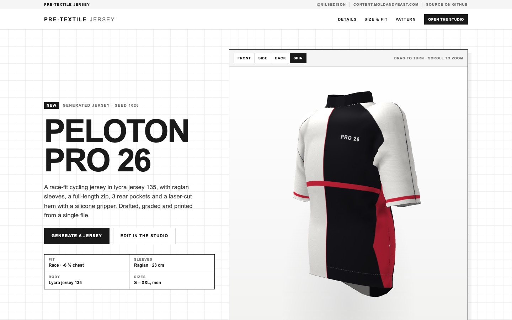
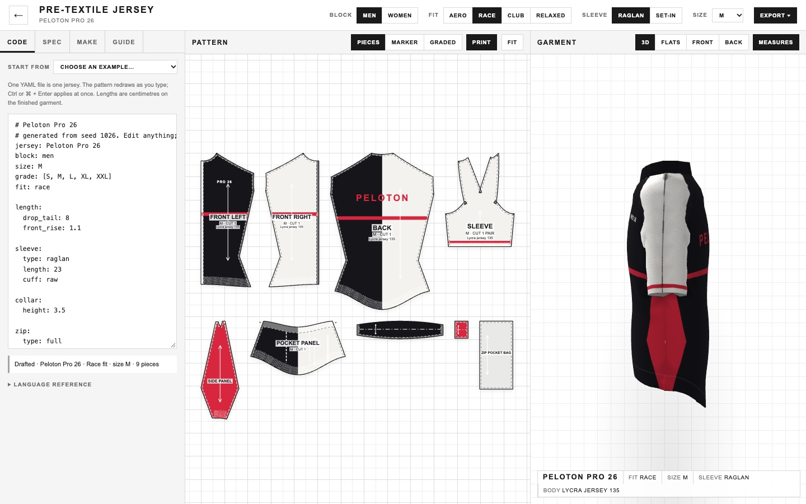

# Pre-Textile Jersey

A cycling jersey drafted from one YAML file, in one HTML file. The file states the fit, the sleeves, the pockets and the print. The browser drafts the pattern pieces from body measurements, grades them across sizes, sews and drapes the jersey in 3D, and exports files a factory can cut and print from.

**Live: https://textile-jersey.moldandyeast.com**





More at https://content.moldandyeast.com · follow [@nilsedison](https://twitter.com/nilsedison) on Twitter · [source on GitHub](https://github.com/moldandyeast/pre-textile-jersey).

## What you get

The page opens on a product page for a jersey that does not exist yet. **Generate a jersey** writes a new one from a seed: a name, a fit, a construction and a print, as YAML. Everything on the page (the 3D render, the flats, the size table, the pattern) is drawn from that file.

**Open the studio** to edit it. Three windows:

- **Spec** (left). **Code** is the jersey as editable YAML, with five examples and a language reference. **Spec** lists the checks, points of measure for every size, and a seam check that compares the stitch-line length of both sides of every seam. **Make** lists the pieces, the materials and the sewing order. **Guide** explains the construction rules and where they come from.
- **Pattern** (centre). The pieces at 1:1 with seam allowance, notches and grain lines. Switch between the piece set, a marker nested on the roll width, and the graded nest of all sizes. Drag to pan, scroll to zoom.
- **Garment** (right). The jersey sewn and draped in 3D, or as front and back flats with measurements.

The top bar switches block (men, women), fit (aero, race, club, relaxed), sleeve (raglan, set-in) and base size (XS to 3XL). Each of those rewrites the YAML.

The jersey is kept in `localStorage`, so it is still there when you reload.

## One file is one jersey

The YAML only states what differs from the defaults. Lengths are centimetres on the finished garment.

```yaml
jersey: Échappée Race
block: men
size: M
grade: [XS, S, M, L, XL]
fit: race

length:
  drop_tail: 9
  front_rise: 1.5

sleeve:
  type: raglan
  length: 23
  cuff: raw
  gripper: true

pockets:
  count: 3
  zip_pocket: right

design:
  base: "#1d2b3a"
  colors:
    side: "#e4572e"
  layers:
    - stripe: 26          # cm below the shoulder line
      height: 5
      on: [front, back, sleeve]
    - text: ÉCHAPPÉE
      on: back
      at: [0, 20]
```

Also in the language: body measurements and ease per size, collar, zip, side panels, hem and grippers, fabric per zone with stretch and weight, seam method and allowance, shrink and bleed for production, and print layers (stripe, chevron, fade, rect, band, text, your own SVG). The full key list is under **Language reference** in the Code tab.

## Exports

| Export | What it is |
| --- | --- |
| Pattern · SVG | Base size at 1:1 in cm. Cut and stitch lines, notches, grain, labels. |
| Graded nest · SVG | Every size in the grade, stacked on each piece. |
| Print file · SVG | Every copy with artwork and bleed, scaled up for press shrink, laid on the roll width. |
| Tiled PDF · A4 | A cover sheet with a check square and a sheet map, then the pattern on A4 pages. |
| Plotter PDF | One page at the marker width. |
| Production pack · ZIP | YAML, DXF (R12, mm), SVG and PDFs per size, print files, spec CSV and the sewing order. |
| Spec sheet · CSV | Points of measure for every size in the grade. |
| Copy YAML | The jersey definition, to the clipboard. |

## How it works

1. **Resolve.** The YAML is read over a set of defaults. The fit preset sets ease, drop tail and front rise, and anything the file states overrides it.
2. **Draft.** Each piece is drawn from the body measurements of its size, not scaled from a base size. The raglan sleeve cap height is solved so the cap matches the armhole. Collars are cut 3% short of the neckline and gripper bands 8% short of the hem, so they are stretched on.
3. **Check.** Both sides of every seam are measured along the stitch line. Ease is compared with the fabric's stretch, and the checks warn when it asks for more than a third of it.
4. **Paint.** One drawing API with two backends, canvas and SVG. The same code paints the pattern, the flats, the print file and the 3D texture, so the cloth carries what the print file carries. Stripes are placed in body coordinates, so they meet at the side seams.
5. **Lay out.** The marker nests every copy on the fabric width and reports how much of the roll is used.
6. **Drape.** The front and back silhouettes are sewn at the shoulder, along the sleeve, under the arm and down the side, then simulated as cloth and shaded in WebGL. The cloth solver is ported from the [Pre-Textile Atelier](https://github.com/moldandyeast/pre-text-atelier).

The construction rules come from the sources listed in the **Guide** tab.

## Repository

The code lives on the [`textile-jersey-github-deploy`](https://github.com/moldandyeast/pre-textile-jersey/tree/textile-jersey-github-deploy) branch. `main` only holds this README and its screenshots.

| Path | What |
| --- | --- |
| `public/index.html` | The deployed piece. One file, no third-party requests, runs offline when saved to disk. Generated by `npm run build`, and committed. |
| `src/pre-textile-jersey.html` | The original piece, verbatim. |
| `src/credits.css`, `src/credits.html` | The credits bar, set in the piece's own type. Shown on the landing page, hidden in the studio and in fullscreen. |
| `build.mjs` | Writes `public/index.html` from the original with five splices: the three libraries inlined in place of their CDN `<script src>` tags, the credits CSS and the credits bar. The piece's own script is not touched. |
| `vendor/` | The three libraries the piece loads, with their licences. |
| `wrangler.jsonc` | An assets-only Cloudflare Worker serving `public/` on the custom domain. No server code. |
| `docs/` | The README screenshots. Not deployed. |

Vendored libraries, each byte-identical to the cdnjs file the original loaded (checked against the cdnjs SRI hash):

| Library | Version | Used for | Licence |
| --- | --- | --- | --- |
| [js-yaml](https://github.com/nodeca/js-yaml) | 4.1.0 | Reading the jersey file | MIT |
| [jsPDF](https://github.com/parallax/jsPDF) | 2.5.1 | The PDF exports | MIT |
| [JSZip](https://github.com/Stuk/jszip) | 3.10.1 | The production pack | MIT or GPLv3, used under MIT |

The build drops jsPDF's trailing `sourceMappingURL` comment so devtools does not ask for a map file. jsPDF still contains a cdnjs URL as a string, inside an output mode (`pdfobjectnewwindow`) that the piece never calls.

The piece sets everything in the system Arial stack, so there is no webfont to ship.

## Build and run

```sh
npm install
npm run build   # src/ + vendor/ → public/index.html
npm run dev     # wrangler dev, serves public/ locally
```

Opening `public/index.html` straight from disk works too.

## Deploy

Deploys are manual. There is no CI, and pushing a branch publishes nothing. Deploying uses your existing `wrangler login` session:

```sh
npm run deploy
```

On the first deploy, wrangler creates the `textile-jersey.moldandyeast.com` DNS record and custom domain.
